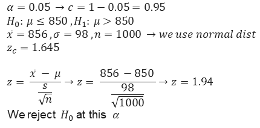
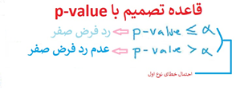
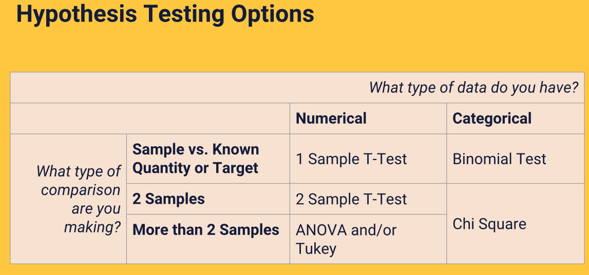
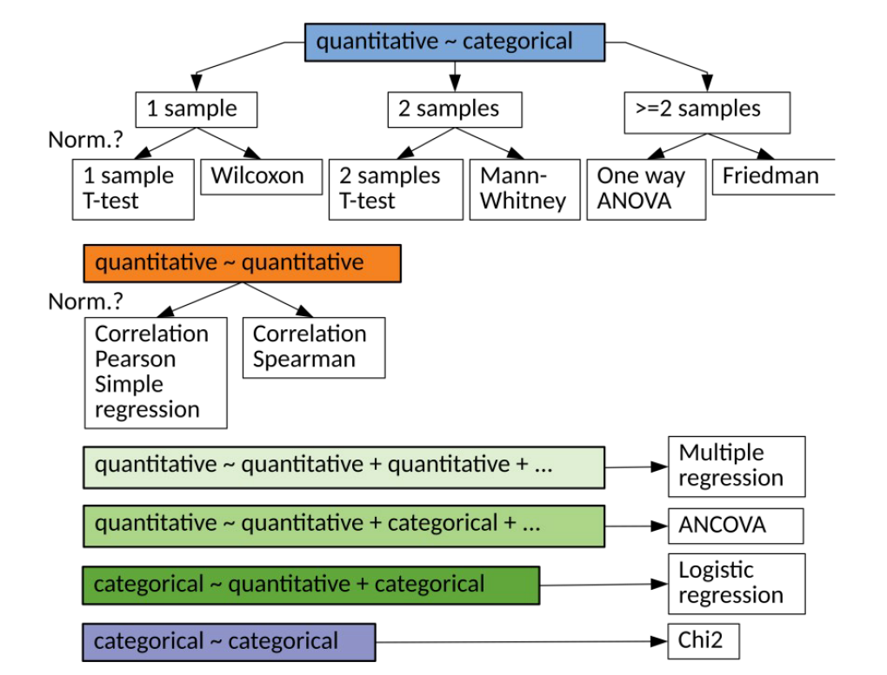
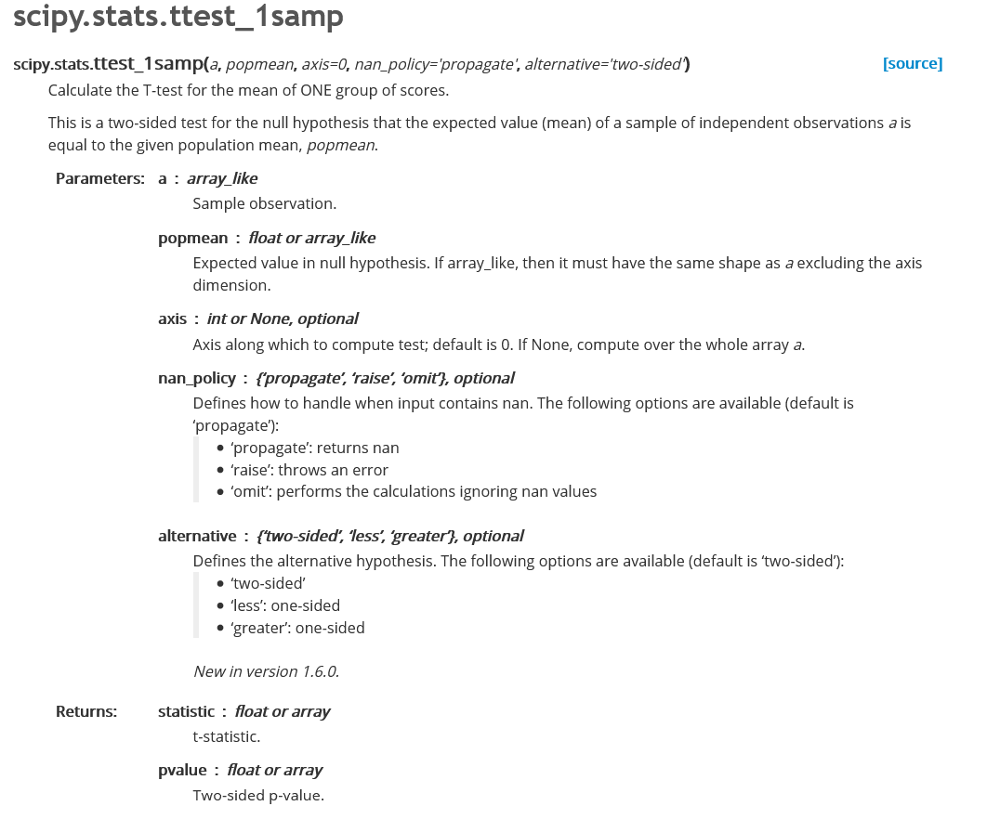
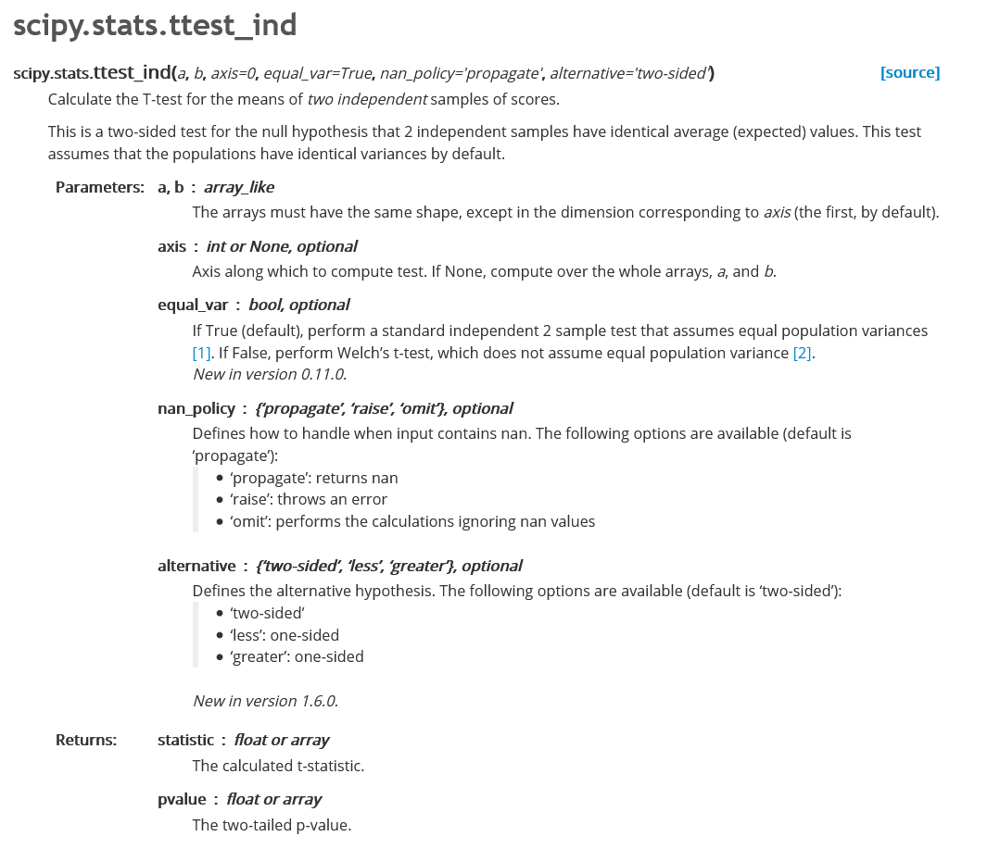
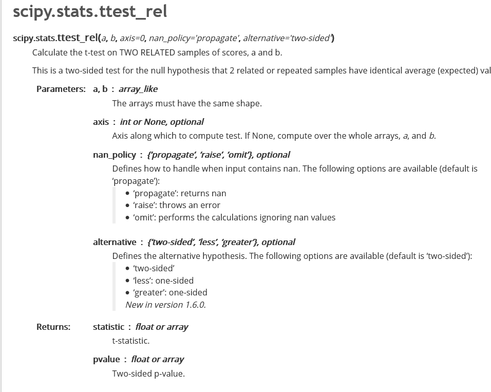

# Interval Estimation

In statistics, interval estimation is the use of sample data to estimate an interval of plausible values of a parameter of interest.

We hold study with 200 participates. This study shows that men on average over 15.7 hours reading books. If the error range for this study is 2.2 hours. Calculate the confidence interval with a certainty level 95%.


<div style="text-align: center;">


</div>

Now we can say with 95% confidence that the average of this sample is between 13.5 and 17.9.

# Inferential statistics:

Inferential statistics is a set of methods in which the characteristics of society are inferred with the help of samples.

The **main difference** between descriptive and inferential statistics is that in descriptive statistics, the results obtained from the statistical sample can never be **generalized to the entire statistical population.**

 Because the goal in this type of statistics is to provide a description of the characteristics of the statistical sample of the research along with There are indicators of tendency towards the center or indicators of tendency towards dispersion.

While in inferential or analytical statistics, the results and findings obtained from the statistical sample can be **generalized to the entire statistical population of the research.**

# Statistical hypothesis testing

In the science of statistics, it is a method to investigate claims or assumptions about distribution parameters in statistical societies. In this method, we are trying to examine the issue and test two hypotheses by using the two concepts of null hypothesis and opposite or alternative hypothesis.

**Example:** A company claims that the average life of the lamps produced by this company is at least 8000 hours.


**Example:** A pharmaceutical company claims that their drug for cancer has significantly prevented the spread of cancer, and 80% of users have not had a particular cancer develop in them.

## Null Hypothesis $(H_0)$

Current values we accept for parameters.

## Alternative Hypothesis ($𝑯_𝒂$  , $𝑯_𝟏$)

Sometimes it is also called a research hypothesis and it includes a claim that we want to investigate.

## Test Statistic

The amount obtained from the sample and based on it we make a decision regarding the claim.

## Level of Confidence

How confident are we in our decisions?

Based on that, another level is also defined, which is called a meaningful level.

#  two-tailed (two-sided) tests

Consider a situation where we want to test the **null hypothesis** $𝐻_0$: $\theta$ = $\theta_0 $ against the opposite (alternative) two-sided hypothesis $𝐻_1$: $\theta$ $\neq$ $\theta_0$ ($\theta$> $\theta_0$, $\theta$< $\theta_0$).

It seems reasonable to accept the null hypothesis when the point estimate $\hat \theta$ for the parameter $\theta$ is close to $\theta_0$ and to reject it when $\hat \theta$ is much larger or smaller than $\theta_0$.

We call tests with the above situation two-tailed (two-sided) tests.

# one-tailed (one-sided) tests

Consider a situation where we want to test the null hypothesis $𝐻_0$: $\theta$ $\leq$ $\theta_0$ against the opposite (alternative) one-sided hypothesis $𝐻_1$: $\theta$>$\theta_0$.

It seems reasonable to reject the null hypothesis when the point estimate 𝜃̂ for the parameter $\theta$ is much larger than $\theta_0$.


We call tests with the above situation one-tailed (one-sided) tests.

# Some examples for a better understanding of null hypothesis and counter hypothesis (alternative):

**Example 1)** A company claims that the coffee machine of this company pours 250 ml of coffee in coffee cups on average. A buyer claims that after repairing the coffee machine of this company, this coffee machine no longer pours an average of 250 ml of coffee. It is desirable to write null hypothesis and alternative hypothesis.


**Example 2)** Doctors believe that teenagers do not sleep more than 10 hours a day on average. A researcher believes that teenagers sleep more than 10 hours a day. It is desirable to write null hypothesis and alternative hypothesis.


# Steps of an assumption test:

1- Formulating the null hypothesis $𝐻_0$ and the reciprocal hypothesis $𝐻_1$ and determining $\alpha$

2- Determine the critical region $\alpha$ by using the sampling distribution, the appropriate test statistic.

3- Determine the value of the test statistic from the sample data.

4- Check whether the value of the test statistic falls in the critical area or not and reject or confirm the null hypothesis accordingly.

**Example 1)** Doctors believe that teenagers do not sleep more than 10 hours a day on average. A researcher believes that teenagers sleep more than 10 hours a day. It is desirable to check this claim with a hypothesis test. The researcher has studied a number of samples, for example 20 teenagers.


**Example 1)** A device pours an average of 2 liters of soda into the glasses. After repairing this machine, the management thinks that the machine is not working properly. If the average of a sample of 20 is equal to 2.10 liters and the standard deviation is equal to 0.33, it is desirable to investigate the claim with a significance level of $\alpha$=𝟎.𝟎𝟏


# Examples for testing the assumption of the mean of a population (large sample z-test)

**Example 1)** The results show that the average score of students in a test is less than 850. A company claims that the students who have attended the courses of this company have received a higher average grade. If we have a sample of 1000 with an average of 856 and a standard deviation of 98, it is desirable to check this claim with a significance level of 0.05.




# P-value

The lowest value of the probability of type 1 error (test level) that can be found in the test statistic will cause the null hypothesis to be rejected. In other words, in a hypothesis test, the probability value (p-value) is equal to the lowest value of the significance level (significance level) or the probability of the first type error, which causes the null hypothesis to be rejected.




# Examples for deciding with 𝒑-𝒗𝒂𝒍𝒖𝒆 on large samples

**Example 1)** A newspaper reports that men get married at the age of 25 on average. Researchers think that this claim of the newspaper is not true and the average age of marriage is more than this amount. If in a sample of 213 men who were studied, the average age of marriage is 25.3 and the standard deviation is 2.3, it is desirable to check this claim with a confidence level of 95%.


**Example 2)** An earlier study has shown that families in Tehran have an average of 1.48 children. A researcher claims that this is not the case, he has a sample of 128 with an average of 1.39 and a standard deviation of 0.84. It is desirable to investigate the claim with a confidence level of 90%.


```python
from google.colab import drive
drive.mount('/gdrive')
```

    Mounted at /gdrive
    


```python
! pip install scipy==1.6.2
```

    Looking in indexes: https://pypi.org/simple, https://us-python.pkg.dev/colab-wheels/public/simple/
    Collecting scipy==1.6.2
      Downloading scipy-1.6.2-cp38-cp38-manylinux1_x86_64.whl (27.2 MB)
         ━━━━━━━━━━━━━━━━━━━━━━━━━━━━━━━━━━━━━━━━ 27.2/27.2 MB 36.6 MB/s eta 0:00:00
    [?25hRequirement already satisfied: numpy<1.23.0,>=1.16.5 in /usr/local/lib/python3.8/dist-packages (from scipy==1.6.2) (1.21.6)
    Installing collected packages: scipy
      Attempting uninstall: scipy
        Found existing installation: scipy 1.7.3
        Uninstalling scipy-1.7.3:
          Successfully uninstalled scipy-1.7.3
    Successfully installed scipy-1.6.2
    


```python
import scipy
print(scipy.__version__)
```

    1.6.2
    






```python
import pandas as pd
from scipy import stats
```


```python
# https://drive.google.com/drive/folders/1kvDhM7-XsXhk-AmTrWd-823WpbazWu9D?usp=sharing
root = '/gdrive/My Drive/Loop Accademy workshop/'
! ls '/gdrive/My Drive/Loop Accademy workshop'
```

    bigmac.csv	    foods.csv		    nba.csv	     revenue.csv
    blood_pressure.csv  fortune1000.csv	    PlantGrowth.csv  salesmen.csv
    chi-test.csv	    google_stock_price.csv  pokemon.csv      ted.csv
    employees.csv	    jamesbond.csv	    quarters.csv
    


```python
df = pd.read_csv(root + 'foods.csv')
df.head()
```


<div>
<style scoped>
    .dataframe tbody tr th:only-of-type {
        vertical-align: middle;
    }

    .dataframe tbody tr th {
        vertical-align: top;
    }

    .dataframe thead th {
        text-align: right;
    }
</style>
<table border="1" class="dataframe">
  <thead>
    <tr style="text-align: right;">
      <th></th>
      <th>First Name</th>
      <th>Gender</th>
      <th>City</th>
      <th>Frequency</th>
      <th>Item</th>
      <th>Spend</th>
    </tr>
  </thead>
  <tbody>
    <tr>
      <th>0</th>
      <td>Wanda</td>
      <td>Female</td>
      <td>Stamford</td>
      <td>Weekly</td>
      <td>Burger</td>
      <td>15.66</td>
    </tr>
    <tr>
      <th>1</th>
      <td>Eric</td>
      <td>Male</td>
      <td>Stamford</td>
      <td>Daily</td>
      <td>Chalupa</td>
      <td>10.56</td>
    </tr>
    <tr>
      <th>2</th>
      <td>Charles</td>
      <td>Male</td>
      <td>New York</td>
      <td>Never</td>
      <td>Sushi</td>
      <td>42.14</td>
    </tr>
    <tr>
      <th>3</th>
      <td>Anna</td>
      <td>Female</td>
      <td>Philadelphia</td>
      <td>Once</td>
      <td>Ice Cream</td>
      <td>11.01</td>
    </tr>
    <tr>
      <th>4</th>
      <td>Deborah</td>
      <td>Female</td>
      <td>Philadelphia</td>
      <td>Daily</td>
      <td>Chalupa</td>
      <td>23.49</td>
    </tr>
  </tbody>
</table>
</div>


# q1 : People spend average 60 $ for food


$$H_0:\mu = 60 $$

$$ H_1:\mu \neq 60$$


we use one sample t-test




```python
df.Spend.isna()
```


    0      False
    1      False
    2      False
    3      False
    4      False
           ...  
    995    False
    996    False
    997    False
    998    False
    999    False
    Name: Spend, Length: 1000, dtype: bool


```python
df.Spend.isna().sum()
```


    0


```python
alpha = 0.05 
tstat,p_value = stats.ttest_1samp(df['Spend'],popmean = 60.0)
print('t stat : {} , p_value : {}'.format(tstat,p_value))
if p_value<= alpha:
    print("reject null hypothesis")
else:
    print("accept null hypothesis")
```

    t stat : -11.325330284771352 , p_value : 4.645385561029907e-28
    t stat : -11.325330284771352 , p_value : 4.645385561029907e-28
    reject null hypothesis
    

# q2 : Gender not effects on spending money for food 


$$H_1:\mu_{Male} \neq \mu_{Female} \rightarrow \mu_{Male} - \mu_{Female}\neq 0$$

$$H_0:\mu_{Male} = \mu_{Female} \rightarrow \mu_{Male} - \mu_{Female} = 0$$

because this two group are independent we use 2 sample independent t-test


```python
female = df[df['Gender']== 'Female']
male = df[df['Gender'] == 'Male']
```


```python
female.head()
```


<div>
<style scoped>
    .dataframe tbody tr th:only-of-type {
        vertical-align: middle;
    }

    .dataframe tbody tr th {
        vertical-align: top;
    }

    .dataframe thead th {
        text-align: right;
    }
</style>
<table border="1" class="dataframe">
  <thead>
    <tr style="text-align: right;">
      <th></th>
      <th>First Name</th>
      <th>Gender</th>
      <th>City</th>
      <th>Frequency</th>
      <th>Item</th>
      <th>Spend</th>
    </tr>
  </thead>
  <tbody>
    <tr>
      <th>0</th>
      <td>Wanda</td>
      <td>Female</td>
      <td>Stamford</td>
      <td>Weekly</td>
      <td>Burger</td>
      <td>15.66</td>
    </tr>
    <tr>
      <th>3</th>
      <td>Anna</td>
      <td>Female</td>
      <td>Philadelphia</td>
      <td>Once</td>
      <td>Ice Cream</td>
      <td>11.01</td>
    </tr>
    <tr>
      <th>4</th>
      <td>Deborah</td>
      <td>Female</td>
      <td>Philadelphia</td>
      <td>Daily</td>
      <td>Chalupa</td>
      <td>23.49</td>
    </tr>
    <tr>
      <th>11</th>
      <td>Rachel</td>
      <td>Female</td>
      <td>Philadelphia</td>
      <td>Seldom</td>
      <td>Sushi</td>
      <td>71.68</td>
    </tr>
    <tr>
      <th>12</th>
      <td>Mary</td>
      <td>Female</td>
      <td>Philadelphia</td>
      <td>Once</td>
      <td>Burger</td>
      <td>1.97</td>
    </tr>
  </tbody>
</table>
</div>


```python
male.head()
```


<div>
<style scoped>
    .dataframe tbody tr th:only-of-type {
        vertical-align: middle;
    }

    .dataframe tbody tr th {
        vertical-align: top;
    }

    .dataframe thead th {
        text-align: right;
    }
</style>
<table border="1" class="dataframe">
  <thead>
    <tr style="text-align: right;">
      <th></th>
      <th>First Name</th>
      <th>Gender</th>
      <th>City</th>
      <th>Frequency</th>
      <th>Item</th>
      <th>Spend</th>
    </tr>
  </thead>
  <tbody>
    <tr>
      <th>1</th>
      <td>Eric</td>
      <td>Male</td>
      <td>Stamford</td>
      <td>Daily</td>
      <td>Chalupa</td>
      <td>10.56</td>
    </tr>
    <tr>
      <th>2</th>
      <td>Charles</td>
      <td>Male</td>
      <td>New York</td>
      <td>Never</td>
      <td>Sushi</td>
      <td>42.14</td>
    </tr>
    <tr>
      <th>5</th>
      <td>Charles</td>
      <td>Male</td>
      <td>Stamford</td>
      <td>Monthly</td>
      <td>Sushi</td>
      <td>93.03</td>
    </tr>
    <tr>
      <th>6</th>
      <td>Mark</td>
      <td>Male</td>
      <td>Philadelphia</td>
      <td>Monthly</td>
      <td>Ice Cream</td>
      <td>30.01</td>
    </tr>
    <tr>
      <th>7</th>
      <td>Paul</td>
      <td>Male</td>
      <td>Philadelphia</td>
      <td>Monthly</td>
      <td>Chalupa</td>
      <td>17.65</td>
    </tr>
  </tbody>
</table>
</div>


```python
female.Spend.isna().sum()
```


    0


```python
male.Spend.isna().sum()
```


    0





```python
alpha = 0.05 
tstat,p_value = stats.ttest_ind(male.Spend,female.Spend,equal_var = True,alternative='two-sided')

print('t stat : {} , p_value : {}'.format(tstat,p_value))
if p_value<= alpha:
    print("reject null hypothesis")
else:
    print("accept null hypothesis")
```

    t stat : -0.7477543082151837 , p_value : 0.45478452030140304
    accept null hypothesis
    


# q3 : City effects on spending money on food


$$H_0: \mu_{Stamford} = \mu_{New York} = \mu_{Philadelphia}$$

$$H_1: \mu_{Stamford} \neq \mu_{New York} \neq \mu_{Philadelphia}$$


```python
df.City.unique()
```


    array(['Stamford', 'New York', 'Philadelphia'], dtype=object)


```python
Stamford = df[df.City=='Stamford']
NewYork = df[df.City=='New York']
Philadelphia = df[df.City == 'Philadelphia']
```


```python
alpha = 0.05 
fstat,p_value = stats.f_oneway(Stamford.Spend ,NewYork.Spend ,Philadelphia.Spend )

print('f stat : {} , p_value : {}'.format(fstat,p_value))
if p_value<= alpha:
    print("reject null hypothesis")
else:
    print("accept null hypothesis")
```

    f stat : 0.07504725668463724 , p_value : 0.9277048853823887
    accept null hypothesis
    


$$H_0: \mu_{Stamford} = \mu_{New York} = \mu_{Philadelphia}$$

$$H_1: \mu_{Stamford} \neq \mu_{New York} \neq \mu_{Philadelphia}$$

# q4 : relation item as categorical feature  and city as categorical feature


```python
contingency_table=pd.crosstab(df["City"],df["Item"])
print('contingency_table : \n',contingency_table)
```

    contingency_table : 
     Item          Burger  Burrito  Chalupa  Donut  Ice Cream  Sushi
    City                                                           
    New York          46       48       44     61         56     58
    Philadelphia      52       58       55     63         73     58
    Stamford          58       62       48     63         47     50
    


```python
contingency_table.values
```


    array([[46, 48, 44, 61, 56, 58],
           [52, 58, 55, 63, 73, 58],
           [58, 62, 48, 63, 47, 50]])


```python
chi2_stat , p_value , dof , expected = stats.chi2_contingency(contingency_table.values)
```


```python
print('dof : ',dof)
```

    dof :  10
    


```python
print('chi2 stat : {} , p_value : {}'.format(chi2_stat,p_value))
```

    chi2 stat : 7.942425445331459 , p_value : 0.6344608189675968
    


```python
print('expected value : \n',expected)
```

    expected value : 
     [[48.828 52.584 46.011 58.531 55.088 51.958]
     [56.004 60.312 52.773 67.133 63.184 59.594]
     [51.168 55.104 48.216 61.336 57.728 54.448]]
    


```python
alpha = 0.05

if p_value<=alpha:
    print("Reject H0,There is a relationship between 2 categorical variables")
else:
    print("Retain H0,There is no relationship between 2 categorical variables")
```

    Retain H0,There is no relationship between 2 categorical variables
    

# q5 : new drug can reduce blood pressure level


$$ H_0 : \mu_{before} = \mu_{after}$$

$$ H_1 : \mu_{before} \neq \mu_{after}$$

we have 2 dependent sample , we use 2 sample dependent test


```python
df = pd.read_csv(root + 'blood_pressure.csv')
df.head()
```


<div>
<style scoped>
    .dataframe tbody tr th:only-of-type {
        vertical-align: middle;
    }

    .dataframe tbody tr th {
        vertical-align: top;
    }

    .dataframe thead th {
        text-align: right;
    }
</style>
<table border="1" class="dataframe">
  <thead>
    <tr style="text-align: right;">
      <th></th>
      <th>patient</th>
      <th>sex</th>
      <th>agegrp</th>
      <th>bp_before</th>
      <th>bp_after</th>
    </tr>
  </thead>
  <tbody>
    <tr>
      <th>0</th>
      <td>1</td>
      <td>Male</td>
      <td>30-45</td>
      <td>143</td>
      <td>153</td>
    </tr>
    <tr>
      <th>1</th>
      <td>2</td>
      <td>Male</td>
      <td>30-45</td>
      <td>163</td>
      <td>170</td>
    </tr>
    <tr>
      <th>2</th>
      <td>3</td>
      <td>Male</td>
      <td>30-45</td>
      <td>153</td>
      <td>168</td>
    </tr>
    <tr>
      <th>3</th>
      <td>4</td>
      <td>Male</td>
      <td>30-45</td>
      <td>153</td>
      <td>142</td>
    </tr>
    <tr>
      <th>4</th>
      <td>5</td>
      <td>Male</td>
      <td>30-45</td>
      <td>146</td>
      <td>141</td>
    </tr>
  </tbody>
</table>
</div>





```python
alpha = 0.05
tstat,p_value = stats.ttest_rel(df['bp_before'],df['bp_after'],alternative='two-sided')

print('t stat : {} , p_value : {}'.format(tstat,p_value))
if p_value<= alpha:
    print("reject null hypothesis")
else:
    print("accept null hypothesis")

```

    t stat : 3.3371870510833657 , p_value : 0.0011297914644840823
    reject null hypothesis
    


```python

```
